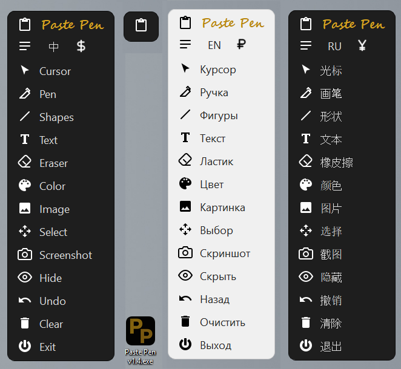

# Paste Pen

**A portable app for drawing over the Windows screen, taking screenshots and inserting images with build in background removal.** An extended alternative to Epic Pen and gInk — no installation required, fully open-source.

💡 *The idea for this app came from my dissatisfaction with how existing alternatives handle inserting images over the desktop. I decided to eliminate this shortcoming in my own app and include all the features I personally needed. Especially, I wanted a feature for inserting charts with the ability to stretch them, transform and remove the background.*

---

## Features

### Drawing & Tools
- Draw with the left and right mouse buttons in **different colors simultaneously**.
- Tools: Pen, Laser Pointer, Shapes (Line, Rectangle, Ellipse, Arrow), Text, Eraser.
- Flexible color and size selection for pen, shapes, text, and eraser.
- Selecting a font for text, moving, rotating, and scaling.
- **Smart vector eraser:** LMB erases pixels; RMB deletes an entire line or shape with a single click.

### Image Handling
- Insert from a file or the clipboard: move, scale proportionally or freely, reshape.
- **Background removal** for inserted images — available at any time after insertion. The result can be saved back to disk.
- **Insert chart** feature with the ability to stretch them and remove the background.
- Layer management: bring images to the front or send them to the back.

### Presentation Mode (Insert Folder)
- Pick a folder of images and flip through them with the mouse wheel right on your desktop (up → previous, down → next). The on-screen position is preserved between slides.
- **Insert Folder without Background:** each file is automatically stripped of its background as you scroll.
- Laser pointer (a red glowing dot) can be toggled on top of any active tool.

### Screenshots & System
- Capture a selected region **together with your drawings**.
- Save to the clipboard and open in the system's default image viewer.
- Multi-monitor support.
- interface in 12 Languages: English, Russian, Chinese, Spanish, Portuguese, French, German, Italian, Arabic, Hindi, Japanese, Korean (language preference is saved automatically).
- Light and dark UI themes.
- Collapsible animated toolbar.

---

## Controls

| Action | Result |
|---|---|
| **LMB + RMB simultaneously** | Instantly switch to Cursor mode; disable laser pointer |
| LMB / RMB with a tool selected | Draw in the assigned color |
| Click the "Color" button with the respective mouse button | Assign color to LMB or RMB |
| RMB on a tool button (pen, eraser, etc.) | Choose size |
| RMB on the “Text” button | Font and text size selection |
| LMB on text in Select mode | Moving text |
| RMB on text in Select mode | Deleting, rotating/scaling text |
| RMB on an image in Select mode | Layer forward/back, delete, remove background |
| LMB on "Screenshot" | Copy to clipboard **+ open viewer** |
| RMB on "Screenshot" | Copy to clipboard only |
| RMB on "Image" | Menu: from clipboard, file, folder**(with scroll)** / **with of without background** |
| LMB on image corners | Resize (proportional / free) |
| RMB on image corners | Transform by X and Y axes |
| RMB on "Cursor" | Toggle laser pointer |
| RMB on "Hide/Show text" | Switch light/dark theme |
| RMB on the language button | Choose language from the menu |

---

## Download

**PastePen.exe** — a single portable file. No installation needed: download and run.

> ⚠️ The program is not digitally signed, so Windows 11 may display a *"Windows protected your PC"* SmartScreen warning. This is a false positive: the source code is fully open and safe.

---

## License

MIT License — free to use for any purpose.

---
---

# Paste Pen

**Портативная программа для рисования поверх экрана Windows, создания скриншотов и вставки изображений cо встроенным удалением фона.** Расширенный аналог Epic Pen и gInk — без установки, с открытым исходным кодом.

💡 *Идея создать собственное приложение возникла из-за недовольства тем, как в существующих аналогах реализована вставка картинок поверх рабочего стола. Я решил исправить это упущение и ещё добавить всё, что мне нужно. Особенно необходима была функция вставки графиков с возможностью их растягивания, трансформации и удаления фона.*

---

## Возможности

### Рисование и инструменты
- Рисование левой и правой кнопкой мыши **разным цветом по выбору**.
- Инструменты: Ручка, Лазерная указка, Фигуры (линия, прямоугольник, эллипс, стрелка), Текст, Ластик.
- Гибкий выбор цвета и размера для пера, фигур, текста и ластика.
- Выбор шрифта для текста, перемещение и поворот текста.
- **Умный векторный ластик:** ЛКМ стирает пиксели, ПКМ — удаляет линию или фигуру целиком одним кликом.

### Работа с изображениями
- Вставка из файла или буфера обмена: перемещение, пропорциональное и свободное масштабирование, изменение формы.
- **Удаление фона** у вставленных изображений — в любой момент после вставки. Результат можно сохранить обратно на компьютер.
- Функция **вставки графиков** с возможностью их растягивания (ЛКМ), трансформации (ПКМ) и удаления фона.
- Управление слоями: перенос картинок на передний или задний план.

### Режим презентаций (вставка папки)
- Выберите папку с изображениями — и листайте их колёсиком мыши прямо поверх рабочего стола (вверх → предыдущее, вниз → следующее).
- **Вставка папки без фона:** каждый файл при перелистывании автоматически очищается от фона.
- Лазерная указка (красная светящаяся точка) включается поверх любого инструмента.

### Скриншоты и система
- Захват выделенной области **вместе с рисунками**.
- Сохранение в буфер обмена и открытие в системном просмотрщике.
- Поддержка нескольких мониторов.
- Интерфейс на 12 языках: английский, русский, китайский, испанский, португальский, французский, немецкий, итальянский, арабский, хинди, японский, корейский. (выбранный язык сохраняется в настройках).
- Светлая и тёмная темы оформления.
- Сворачивающаяся анимированная панель инструментов.

---

## Управление

| Действие | Результат |
|---|---|
| **ЛКМ + ПКМ одновременно** | Мгновенный переход в режим «Курсор», отключение лазерной указки |
| ЛКМ / ПКМ при выбранном инструменте | Рисование соответствующим цветом |
| Клик по кнопке «Цвет» нужной кнопкой мыши | Назначить цвет на ЛКМ или ПКМ |
| ПКМ по кнопке инструмента (перо, ластик, текст) | Выбор размера |
| ПКМ по кнопке «Текст»| Выбор шрифта и размера текста |
| ЛКМ по тексту в режиме Выбор | Перемещение текста |
| ПКМ по тексту в режиме Выбор | Удаление, поворот/масштабирование текста  |
| ПКМ по картинке в режиме «Выбор» | Удаление, Слой вперёд/назад, убрать фон, сохранить как |
| ЛКМ по «Скриншот» | Копировать в буфер **+ открыть просмотр** |
| ПКМ по «Скриншот» | Только копировать в буфер |
| ПКМ по «Картинка» | Меню: вставка из буфера, файла, папки (со скроллом), с фоном и без |
| ЛКМ по углам вставленного изображение | Растягивание изображения (с сохранением пропорций и без) |
| ПКМ по углам вставленного изображение | Трансформация изображения по осям Х и Y (с сохранением пропорций и без) |
| ПКМ по «Курсор» | Вкл./выкл. лазерную указку |
| ПКМ по «Скрыть/Показать текст» | Переключение светлой/тёмной темы |
| ПКМ по кнопке языка | Выбор языка из меню |

---

## Скачать

**PastePen.exe** — портативный файл. Не требует установки: скачайте и запустите.

> ⚠️ Программа не имеет цифровой подписи, поэтому Windows 11 может показать предупреждение *«Система Windows защитила ваш компьютер»* (SmartScreen). Это ложное срабатывание: код полностью открыт и безопасен.

---

## Лицензия

MIT License — свободное использование для любых целей.
